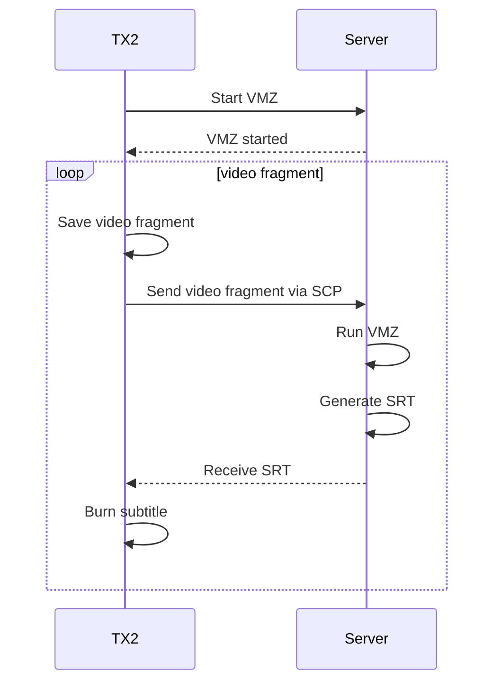

# Client program for TX2

## Sequence

The sequence diagram below can be visualized using [Mermaid Live Editor](https://mermaidjs.github.io/mermaid-live-editor/).



## Requirements

* TX2
  * FFmpeg
  * SSH private key to the server
* Server
  * VMZ

## Usage

1. Send any video fragment file to the Server. The file name should be `tx2test.mp4`. This is required to prepare VMZ running.
1. Start saving video fragments on TX2.
1. Run the client program on TX2.
1. Play videos using a generated playlist.

## Scripts

### Save video fragment

Save 10s video fragments with preview.

```bash
gst-launch-1.0 nvcamerasrc ! 'video/x-raw(memory:NVMM),width=400,height=300' ! tee name=t \
  t. ! nvoverlaysink overlay-x=1500 overlay-y=880 overlay-w=400 overlay-h=300 async=FALSE \
  t. ! omxh264enc ! splitmuxsink location=input/tx2_%04d.mp4 max-size-time=10000000000
```

### Generate playlist

```bash
echo "#EXTM3U" > tx2.m3u
for i in $(seq -f "%04g" 0 360);
do
  echo tx2_$i.mp4 >> tx2.m3u
done
```
